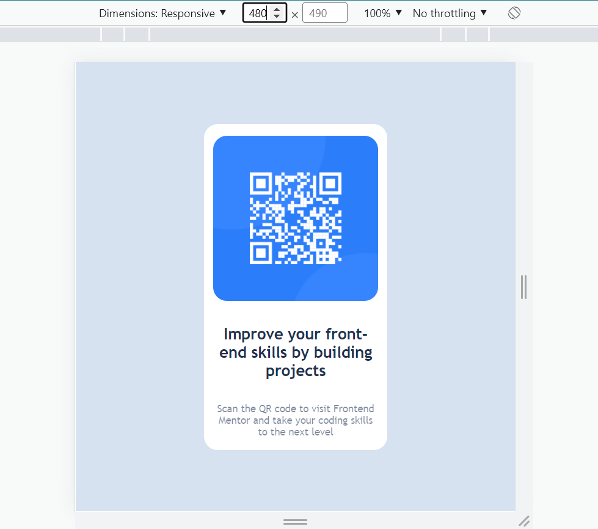

# Challenge Accepted - Frontend Mentor - QR code component solution

This is a solution to the [QR code component challenge on Frontend Mentor](https://www.frontendmentor.io/challenges/qr-code-component-iux_sIO_H). Frontend Mentor challenges help you improve your coding skills by building realistic projects. 

## Table of contents

- [Overview](#overview)
  - [Screenshot](#screenshot)
  - [Links](#links)
  - [Built with](#built-with)
## Overview

It's just a level-1(Newbie) challenge.Project just to show a responsive QR code component.

### Screenshot

### Links

- Solution URL: [Solution](https://tushar7567.github.io/Frontend-Challenge/QR-code-component/qr-code-component-main/index.html)

### Built with

-  HTML5 
- Sass

